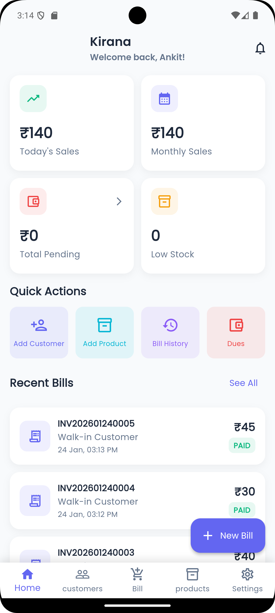
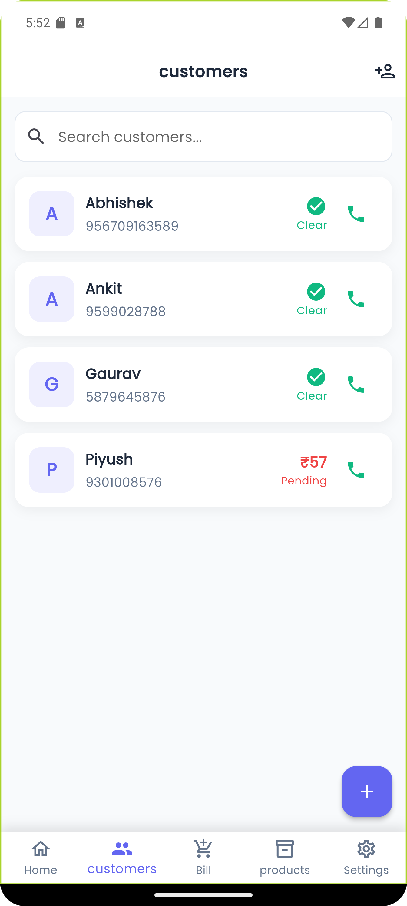
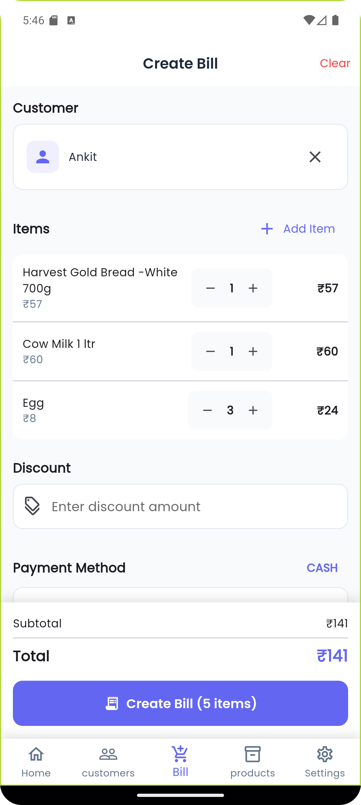
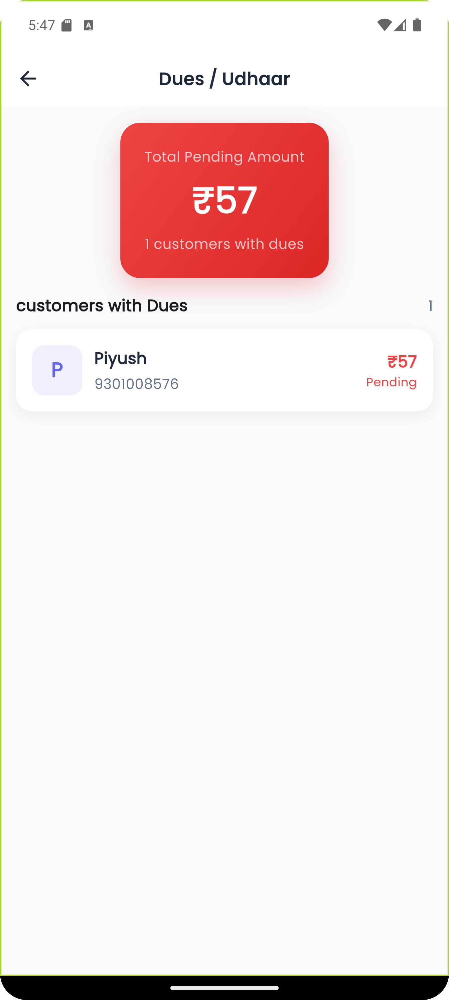
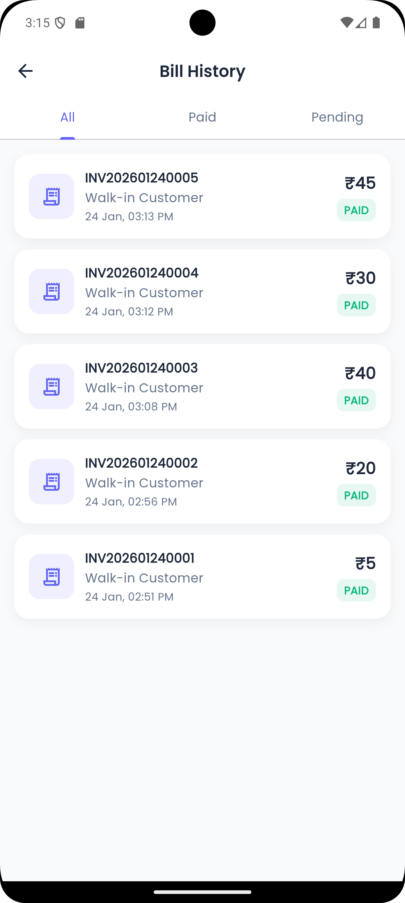
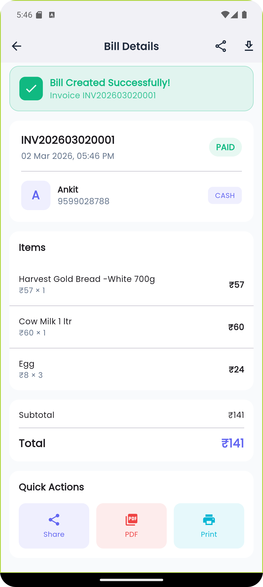

<div align="center">

# 🏪 khata — Smart Shopkeeper Billing & Udhaar App

**A powerful yet simple app built for small shopkeepers to manage bills, customers, and loans — all in one place.**

[](https://flutter.dev)
[](https://spring.io/projects/spring-boot)
[](https://www.postgresql.org)
[](LICENSE)

[Features](#-features) • [Screenshots](#-screenshots) • [Tech Stack](#️-tech-stack) • [Getting Started](#-getting-started) • [Roadmap](#-roadmap) • [Contributing](#-contributing)

</div>

---

## 📖 About

**Dukaan Ledger** is a mobile application designed for small Indian shopkeepers — kirana stores, medical shops, hardware stores, and more. It replaces the traditional paper ledger with a fast, reliable digital solution that works even offline.

Track every sale, manage customer credit (udhaar), generate PDF bills, and share them instantly via WhatsApp — all from your phone.

### 🎯 Who is it for?

| Shop Type | Use Case |
|-----------|----------|
| 🛒 Kirana / Grocery Stores | Daily billing & udhaar tracking |
| 💊 Medical Shops | Customer records & dues |
| 🔧 Hardware Stores | Product stock & invoices |
| 📱 Mobile & Electronics | Sales tracking & PDF bills |
| 👗 Small Retail | Customer management & analytics |

---

## ✨ Features

### 🔐 Authentication
- Phone + OTP or Email login
- Secure JWT-based sessions
- Single shop support (multi-shop in Phase 2)

### 👥 Customer Management
- Add customers with name, phone, and address
- View full transaction history per customer
- Instantly see total pending loan per customer

### 📦 Product Management
- Add and edit products with name, price & stock
- Quick product search while billing
- Low-stock alerts *(coming soon)*

### 🧾 Billing System
- Create bills in seconds — Cash / UPI / Credit
- Auto-calculate totals
- **Generate PDF invoices**
- **Share bill directly via WhatsApp**

### 💰 Udhaar (Loan) Management
- Mark any bill as credit (udhaar)
- Track total loan, amount paid & amount due
- Full payment history per customer
- Due reminders *(coming soon)*

### 📊 Dashboard
- Today's sales at a glance
- Monthly revenue overview
- Total pending loans summary
- Top customers by purchase value

---

## 📸 Screenshots

> *Add your app screenshots below. Recommended: use a 3-column grid for mobile screens.*

<div align="center">

### Dashboard & Home
| Dashboard | Customer List | Billing Screen |
|:---------:|:-------------:|:--------------:|
|  |  |  |

### Udhaar & Reports
| Udhaar Tracker | Payment History | PDF Bill |
|:--------------:|:---------------:|:--------:|
|  |  |  |

</div>

---

## 🛠️ Tech Stack

### 📱 Frontend
- **Flutter** — Cross-platform mobile (Android + iOS)
- **Room / SQLite** — Local offline cache
- **flutter_pdf** — PDF bill generation
- **WhatsApp Intent Sharing** — One-tap bill sharing

### 🔧 Backend
- **Spring Boot** — REST API server
- **JWT Authentication** — Secure token-based auth
- **Role-based Access Control**

### 🗄️ Database
- **PostgreSQL / MySQL** — Cloud database
- **SQLite (Room)** — Offline-first local storage

---

## 🚀 Getting Started

### Prerequisites

- [Flutter SDK](https://flutter.dev/docs/get-started/install) (3.x or above)
- [Java 17+](https://adoptium.net/) (for Spring Boot backend)
- [PostgreSQL](https://www.postgresql.org/download/) or MySQL
- Android Studio / VS Code

---

### 📱 Flutter App Setup

```bash
# Clone the repository
git clone https://github.com/ankitsingh0913/khata.git
cd dukaan-ledger/flutter_app

# Install dependencies
flutter pub get

# Run on connected device or emulator
flutter run
```

Configure your backend URL in `lib/config/app_config.dart`:
```dart
const String baseUrl = 'http://localhost:8080/api/v1';
```

---

### 🔧 Backend Setup (Spring Boot)

```bash
cd dukaan-ledger/backend

# Configure database in src/main/resources/application.properties
spring.datasource.url=jdbc:postgresql://localhost:5432/dukaan_db
spring.datasource.username=your_username
spring.datasource.password=your_password

# Build and run
./mvnw spring-boot:run
```

---

### 🗄️ Database Setup

```sql
-- Create the database
CREATE DATABASE dukaan_db;

-- Tables are auto-created via Spring Boot JPA on first run
```

---

## 📁 Project Structure

```
lib/
├── main.dart
├── config/
│   ├── app_theme.dart
│   └── app_constants.dart
├── models/
│   ├── customer.dart
│   ├── product.dart
│   ├── bill.dart
│   ├── bill_item.dart
│   ├── payment.dart
│   └── shop.dart
├── services/
│   ├── database_service.dart
│   ├── auth_service.dart
│   ├── pdf_service.dart
│   └── share_service.dart
├── providers/
│   ├── auth_provider.dart
│   ├── customer_provider.dart
│   ├── product_provider.dart
│   ├── bill_provider.dart
│   └── dashboard_provider.dart
├── screens/
│   ├── splash_screen.dart
│   ├── auth/
│   │   ├── login_screen.dart
│   │   └── otp_screen.dart
│   ├── dashboard/
│   │   └── dashboard_screen.dart
│   ├── customers/
│   │   ├── customer_list_screen.dart
│   │   ├── customer_detail_screen.dart
│   │   └── add_customer_screen.dart
│   ├── products/
│   │   ├── product_list_screen.dart
│   │   └── add_product_screen.dart
│   ├── billing/
│   │   ├── create_bill_screen.dart
│   │   ├── bill_detail_screen.dart
│   │   └── bill_history_screen.dart
│   └── loans/
│       ├── loan_dashboard_screen.dart
│       └── payment_screen.dart
└── widgets/
    ├── custom_button.dart
    ├── custom_text_field.dart
    ├── stat_card.dart
    ├── customer_card.dart
    ├── product_card.dart
    └── bill_card.dart
```

---

## 🗺️ Roadmap

### ✅ Phase 1 — MVP (Current)
- [x] Customer management
- [x] Product catalog
- [x] Billing (Cash / UPI / Credit)
- [x] Udhaar tracking
- [x] PDF bill generation
- [x] WhatsApp sharing
- [x] Dashboard analytics

### 🔄 Phase 2 — Coming Soon
- [ ] Offline mode (full offline-first support)
- [ ] GST billing support
- [ ] Cloud backup & sync
- [ ] Customer SMS reminders for dues
- [ ] Multi-shop support
- [ ] Voice input (Hindi & English)
- [ ] AI insights — best-selling products, high-risk customers

---

## 🤝 Contributing

Contributions are welcome! If you'd like to improve this project:

1. Fork the repository
2. Create your feature branch: `git checkout -b feature/your-feature`
3. Commit your changes: `git commit -m 'Add some feature'`
4. Push to the branch: `git push origin feature/your-feature`
5. Open a Pull Request

Please open an issue first to discuss major changes.

---

## 📄 License

This project is licensed under the [MIT License](LICENSE).

---

## 🙏 Acknowledgements

- [Flutter](https://flutter.dev) for the amazing cross-platform framework
- [Spring Boot](https://spring.io) for the robust backend
- Every small shopkeeper in India who inspired this project 🇮🇳

---

<div align="center">

Made with ❤️ for Indian shopkeepers

⭐ If you find this useful, give it a star!

</div>
